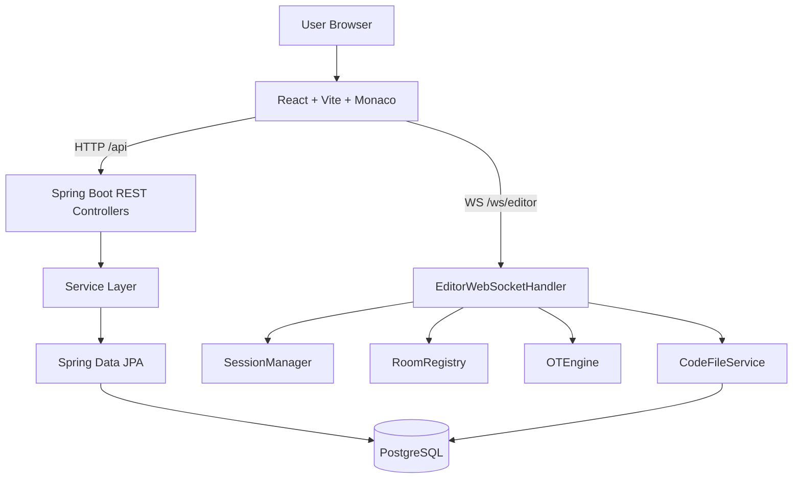
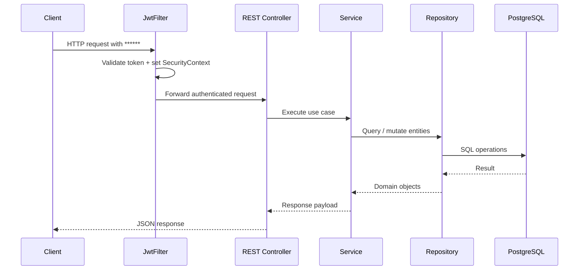
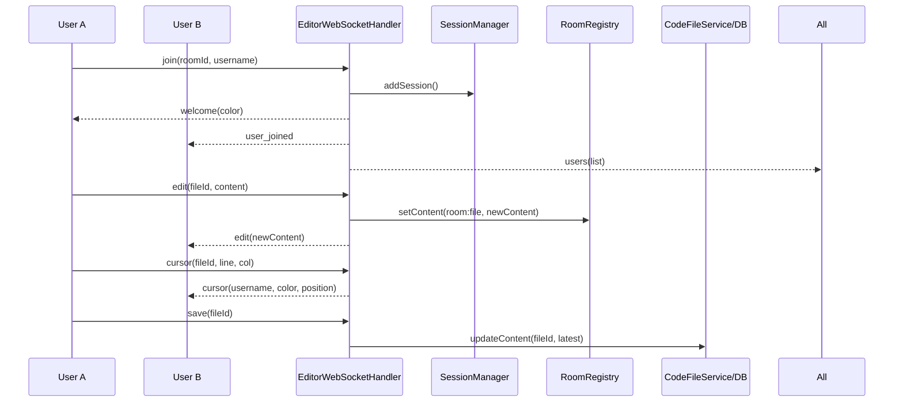
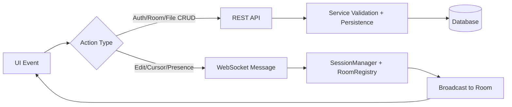
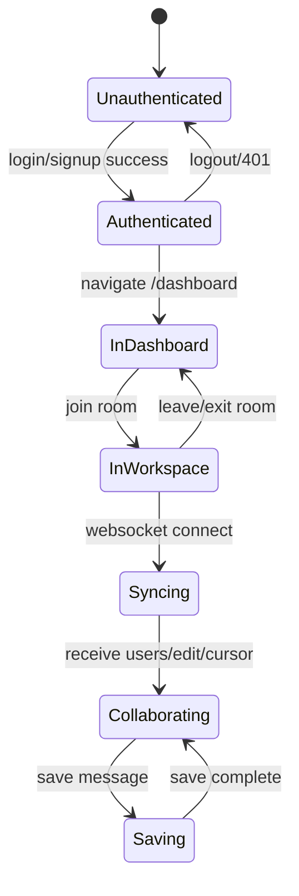
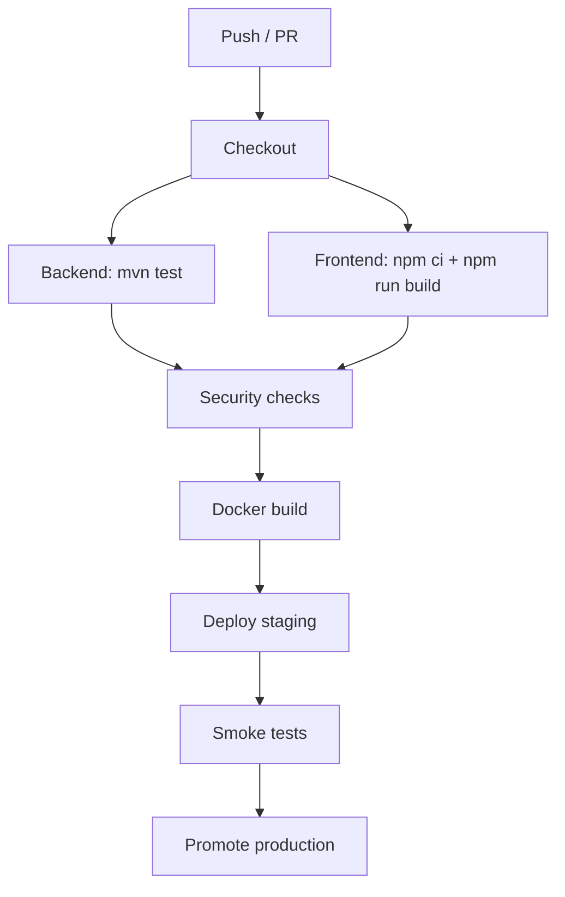

<div align="center">
  

# CollabWrite

### Real-time collaborative Java coding workspace with shared cursors, rooms, and persistent file state.

Build once, code together instantly: secure room-based collaboration powered by React + Monaco, Spring Boot APIs, WebSockets, and PostgreSQL.

<p>
  
  
  
  
  
</p>

<p>
  <a href="https://github.com/akshatddyl/collabwrite/graphs/contributors"></a>
  <a href="https://github.com/akshatddyl/collabwrite/stargazers"></a>
  <a href="https://github.com/akshatddyl/collabwrite/network/members"></a>
  
</p>

<p>
  <a href="#api-documentation"></a>
  <a href="#installation-guide"></a>
  <a href="#quick-start"></a>
  <a href="#showcase"></a>
  <a href="#contributing"></a>
</p>
</div>

---

## Showcase

| Workspace Preview | Dashboard Preview |
|---|---|
|  |  |

| Collaboration Demo GIF | API / State Trace Preview |
|---|---|
|  |  |

> [!TIP]
> Replace the placeholders above with product screenshots from `/frontend` once production UI captures are ready.

---

## Table of Contents

- [Project Overview](#project-overview)
- [Key Features](#key-features)
- [System Architecture](#system-architecture)
- [Internal Working](#internal-working)
- [Detailed Component Breakdown](#detailed-component-breakdown)
- [Project Structure](#project-structure)
- [Technology Stack](#technology-stack)
- [Installation Guide](#installation-guide)
- [Quick Start](#quick-start)
- [Usage Guide](#usage-guide)
- [API Documentation](#api-documentation)
- [Database Design](#database-design)
- [Configuration Reference](#configuration-reference)
- [Security](#security)
- [Performance](#performance)
- [Monitoring & Observability](#monitoring--observability)
- [Testing](#testing)
- [CI/CD Pipeline](#cicd-pipeline)
- [Troubleshooting](#troubleshooting)
- [Roadmap](#roadmap)
- [Contributing](#contributing)
- [Changelog](#changelog)
- [License](#license)
- [Acknowledgements](#acknowledgements)

---

## Project Overview

CollabWrite is a room-based real-time collaborative coding platform focused on Java editing workflows. Users authenticate with JWT, create/join rooms via invite codes, collaborate in a Monaco-powered editor, and persist files to PostgreSQL.

### Why it exists

- Remote pair-programming and group coding need low-friction shared workspaces.
- Typical “paste snippets in chat” collaboration loses context, cursors, and room ownership controls.
- CollabWrite centralizes identity, rooms, real-time edit broadcasting, and persistent file storage in one product.

### Audience

| Audience | Outcome |
|---|---|
| Students and coding cohorts | Shared project room with instant join links |
| Interviewers and candidates | Live editor with synchronized view |
| Developer teams | Lightweight collaborative coding session environment |

### Value delivered

| Dimension | Value |
|---|---|
| Business value | Faster collaboration cycles, easier onboarding into active coding sessions |
| Technical value | Clean split between REST (resource lifecycle) and WebSocket (live synchronization) |
| Operational value | Dockerized backend + PostgreSQL local deployment |

### Why choose CollabWrite

- Room and member semantics are explicit (owner, member, leave/delete behavior).
- Persistent files with download support.
- Cursor presence awareness for multi-user context.
- Fast frontend with Vite and state slices via Zustand.

---

## Key Features

| Feature | Description | Status |
|---|---|---|
| JWT authentication | Signup/login with token-based session continuity | ✅ |
| Room management | Create, discover, join, leave, and owner-only delete | ✅ |
| Invite-based collaboration | UUID invite code driven room entry | ✅ |
| File management | Create, rename, delete, edit, download files | ✅ |
| Live collaboration | WebSocket join/edit/cursor/save/select_file message model | ✅ |
| Presence layer | Connected users + remote cursor broadcast | ✅ |
| Reconnect handling | Session deduplication on reconnect in same room | ✅ |
| Persistent storage | PostgreSQL via Spring Data JPA | ✅ |
| Containerized backend | Multi-stage Docker build for Spring Boot service | ✅ |
| Automated coverage reporting | Coverage badge intentionally marked “Not Reported” | 🚧 |

---

## System Architecture

CollabWrite is a two-channel architecture:

1. **REST channel** for identity, rooms, and files lifecycle.
2. **WebSocket channel** for low-latency collaboration updates.

### High-level architecture



### Layer responsibilities

| Layer | Core modules | Responsibility |
|---|---|---|
| Presentation | React pages/components, Monaco editor | UX, user actions, local state, websocket client |
| Application | Controllers + WebSocket handler | Route requests/messages to domain services |
| Domain service | AuthService, RoomService, CodeFileService | Business logic and invariants |
| Data | Repositories + entities | Persistence and relational mapping |
| Infra | Docker, PostgreSQL, Spring Security | Runtime, security, deployment |

---

## Internal Working

This section documents runtime behavior end-to-end.

### 1) Request lifecycle (REST)



### 2) Real-time collaboration lifecycle (WebSocket)



### 3) Core execution flow



### 4) State model (frontend)



### 5) Internal mechanics summary

| Concern | Current implementation |
|---|---|
| Business logic processing | Service-layer checks (ownership, uniqueness, room existence) |
| State management | Zustand slices (`auth`, `room`, `editor`) |
| Module communication | REST for resources, WebSocket for collaboration events |
| Dependency relationships | Controllers -> Services -> Repositories -> DB |
| Background jobs | None currently (request-driven processing only) |
| Queue processing | Not present in current architecture |
| Error handling | Runtime exceptions + HTTP errors + WS error events |
| Retry mechanisms | Frontend WebSocket reconnect timer (3s) |
| Caching strategy | In-memory room/file text cache in `RoomRegistry` |
| Security mechanisms | JWT auth, BCrypt passwords, Spring Security filter chain |
| Validation pipeline | Bean validation for auth + service-level guard checks |
| Logging system | SLF4J logging in WebSocket/session flows |
| Monitoring strategy | Log-driven visibility; no metrics/tracing system yet |
| Performance optimizations | Debounced edit emits (50ms), deduplicated sessions/users |

> [!IMPORTANT]
> The server currently applies **last-write-wins full document updates** in `OTEngine`. This is simple and fast, but not a full server-side CRDT/OT implementation.

---

## Detailed Component Breakdown

### Frontend (React)

| Component | Purpose | Inputs | Outputs | Dependencies |
|---|---|---|---|---|
| `App.jsx` | Route orchestration and route protection | auth state | rendered page | React Router, Zustand |
| `DashboardPage.jsx` | Room listing, search, create/join actions | user actions | room CRUD calls | roomService, toast |
| `WorkspacePage.jsx` | Collaboration workspace shell | invite code, selected file | websocket + file operations | useCollaboration, store |
| `MonacoEditor.jsx` | Editing, cursor events, remote decorations | file content, cursors | local edit/cursor callbacks | Monaco, store |

### Hooks and communication

| Module | Purpose | Internal workflow |
|---|---|---|
| `useAuth` | login/signup/logout operations | Calls authService, updates store, routes user |
| `useWebSocket` | socket lifecycle and message dispatch | connect, parse, handle event types, reconnect, cleanup |
| `useCollaboration` | bridge editor events to transport | debounced edit, cursor, save, file-select messaging |

### Backend (Spring Boot)

| Component | Purpose | Inputs | Outputs | Dependencies |
|---|---|---|---|---|
| `AuthController` / `AuthService` | Identity and token issuance | signup/login payloads | JWT + user payload | UserRepository, JwtUtil |
| `RoomController` / `RoomService` | Room lifecycle and membership | invite code, username, room ID | room DTOs + membership changes | RoomRepository, UserRepository |
| `CodeFileController` / `CodeFileService` | File lifecycle + persistence | file ID, room code, content | file records + binary download | CodeFileRepository |
| `EditorWebSocketHandler` | Real-time edit/cursor/presence operations | JSON WS messages | room broadcasts + persistence save | SessionManager, RoomRegistry |

### Data model entities

| Entity | Responsibilities | Relationships |
|---|---|---|
| `User` | account identity, credentials, timestamps | owns rooms, can be room member |
| `Room` | collaboration unit with invite code and owner | many members, one owner, many files |
| `CodeFile` | file metadata and editor content snapshot | belongs to one room |

---

## Project Structure

```text
collabwrite/
├── backend/
│   ├── src/main/java/com/collabedit/
│   │   ├── auth/                 # JWT auth controllers/services/filter + DTOs
│   │   ├── config/               # CORS, security chain, websocket registration
│   │   ├── file/                 # File entity/repository/service/controller
│   │   ├── room/                 # Room entity/repository/service/controller + DTOs
│   │   ├── user/                 # User entity/service/repository/controller
│   │   └── websocket/            # Realtime handler, session manager, message contracts
│   ├── src/main/resources/
│   │   └── application.properties
│   ├── Dockerfile
│   └── pom.xml
├── frontend/
│   ├── src/
│   │   ├── components/           # UI modules (auth, dashboard, editor, layout, filetree)
│   │   ├── hooks/                # Auth, websocket, collaboration hooks
│   │   ├── pages/                # Login, signup, dashboard, workspace
│   │   ├── services/             # Axios API and domain service wrappers
│   │   ├── store/                # Zustand slices (auth/room/editor)
│   │   ├── styles/               # Tailwind/global styles
│   │   └── utils/                # Constants and helpers
│   ├── package.json
│   └── vite.config.js
└── docker-compose.yml            # PostgreSQL + backend local stack
```

### Directory responsibilities

| Path | Responsibility | Important files |
|---|---|---|
| `backend/src/main/java/com/collabedit/auth` | Authentication and JWT issuance/verification | `AuthService`, `JwtFilter`, `JwtUtil` |
| `backend/src/main/java/com/collabedit/websocket` | Live collaboration transport | `EditorWebSocketHandler`, `SessionManager`, `RoomRegistry` |
| `frontend/src/components/editor` | Code editor UX | `MonacoEditor.jsx`, `EditorToolbar.jsx` |
| `frontend/src/hooks` | App-level behavior composition | `useWebSocket.js`, `useCollaboration.js` |
| `frontend/src/store` | Client-side state graph | `authSlice.js`, `roomSlice.js`, `editorSlice.js` |

---

## Technology Stack

### Frontend

| Technology | Role | Why used |
|---|---|---|
| React 18 | Component-driven UI | Mature ecosystem and performant rendering |
| Vite | Dev server and bundler | Fast HMR and modern build pipeline |
| Monaco Editor | Code editing surface | IDE-like editing features |
| Zustand | Global state management | Minimal API and slice-based organization |
| React Router | Client-side routing | Protected/authenticated route flows |
| Tailwind CSS | Styling system | Rapid, consistent UI composition |

### Backend

| Technology | Role | Why used |
|---|---|---|
| Spring Boot 3 | API and app runtime | Production-grade Java app framework |
| Spring Security | Auth chain | JWT filter integration and route protection |
| Spring WebSocket | Real-time transport | Low-latency collaboration channel |
| Spring Data JPA | Data access abstraction | Simplified persistence and repository patterns |
| JWT (jjwt) | Stateless auth tokens | Lightweight secure session model |

### Database & Infrastructure

| Category | Technology | Role |
|---|---|---|
| Database | PostgreSQL 16 | Durable storage for users, rooms, files |
| Containers | Docker, Docker Compose | Local reproducible service orchestration |
| Runtime | Eclipse Temurin Java 17 | Standardized JDK/JRE images |

### DevOps / Monitoring / Security / Testing

| Category | Current status |
|---|---|
| DevOps | Local build via Maven + npm; compose-based runtime |
| Monitoring | Structured logs (SLF4J) without metrics backend |
| Security | JWT + BCrypt + CORS config + protected `/api/**` routes |
| Testing | Backend `mvn test` available (currently no test classes); frontend build validation |

---

## Installation Guide

### Prerequisites

- Java 17+
- Maven 3.9+
- Node.js 18+
- npm 9+
- PostgreSQL 16 (or Docker)

### Local installation

```bash
# Clone
cd /path/to/workspace
git clone https://github.com/akshatddyl/collabwrite.git
cd collabwrite

# Backend
cd backend
mvn clean install

# Frontend
cd ../frontend
npm install
```

### Environment variables

#### Backend `.env.example`

```env
SPRING_DATASOURCE_URL=jdbc:postgresql://localhost:5432/collabedit
SPRING_DATASOURCE_USERNAME=collabedit
SPRING_DATASOURCE_PASSWORD=collabedit_secret
PORT=8080
JWT_SECRET_BASE64=replace_with_base64_256bit_secret
JWT_EXPIRATION_MS=86400000
```

#### Frontend `.env.example`

```env
VITE_API_URL=http://localhost:8080/api
VITE_WS_URL=ws://localhost:8080/ws/editor
```

| Variable | Default | Description |
|---|---|---|
| `SPRING_DATASOURCE_URL` | required | PostgreSQL JDBC URL |
| `SPRING_DATASOURCE_USERNAME` | required | DB username |
| `SPRING_DATASOURCE_PASSWORD` | required | DB password |
| `PORT` | `8080` | Spring server port |
| `VITE_API_URL` | `http://localhost:8080/api` | Frontend REST base URL |
| `VITE_WS_URL` | `ws://<host>:8080/ws/editor` | Frontend WebSocket endpoint |

> [!CAUTION]
> `backend/src/main/resources/application.properties` currently contains a hard-coded JWT secret. For production, move this to environment-driven secrets immediately.

### Docker setup

```bash
cd /home/runner/work/collabwrite/collabwrite
docker compose up --build
```

Services:
- PostgreSQL: `localhost:5432`
- Backend API: `localhost:8080`

### Production setup (recommended baseline)

1. Build backend jar (`mvn clean package -DskipTests`).
2. Build frontend static assets (`npm run build`).
3. Use environment-injected secrets for DB and JWT.
4. Reverse-proxy API + WebSocket endpoints behind TLS.
5. Enable managed DB backups and log aggregation.

---

## Quick Start

```bash
# 1) Start backend dependencies
cd /home/runner/work/collabwrite/collabwrite
docker compose up -d postgres

# 2) Run backend
cd backend
SPRING_DATASOURCE_URL=jdbc:postgresql://localhost:5432/collabedit \
SPRING_DATASOURCE_USERNAME=collabedit \
SPRING_DATASOURCE_PASSWORD=collabedit_secret \
mvn spring-boot:run

# 3) Run frontend
cd ../frontend
npm install
npm run dev
```

First success criteria:
- Open `http://localhost:5173`
- Signup/login
- Create room and open workspace
- Open second browser/session with same invite code to see live cursor/edit updates

---

## Usage Guide

### Basic usage

1. Create account or login.
2. Create a room from dashboard.
3. Share invite code.
4. Open workspace and edit files collaboratively.
5. Save changes (`Ctrl/Cmd + S`) to persist to database.

### Advanced usage

- **Room ownership controls**: owner can delete room; members can leave.
- **File workflows**: create/rename/delete files in sidebar.
- **Presence tracking**: active users and cursor markers update in near real-time.

### Common workflows

| Workflow | Steps |
|---|---|
| Pair programming | Create room -> invite collaborator -> open same file -> live edit |
| Group code review | Join room -> open candidate file -> discuss with cursor presence |
| Teaching | Instructor creates room -> students join -> synchronized walkthrough |

### Best practices

- Keep file granularity small for easier collaboration.
- Save periodically to persist latest in-memory state.
- Use stable network to reduce reconnect churn.

---

## API Documentation

### Authentication

| Method | Endpoint | Auth | Description |
|---|---|---|---|
| POST | `/api/auth/signup` | No | Register and receive token |
| POST | `/api/auth/login` | No | Login and receive token |

### User

| Method | Endpoint | Auth | Description |
|---|---|---|---|
| GET | `/api/users/me` | Yes | Get current user profile |

### Rooms

| Method | Endpoint | Auth | Description |
|---|---|---|---|
| POST | `/api/rooms` | Yes | Create room |
| GET | `/api/rooms` | Yes | List user-owned/member rooms |
| GET | `/api/rooms/invite/{inviteCode}` | Yes | Resolve room by invite code |
| POST | `/api/rooms/join/{inviteCode}` | Yes | Join room |
| DELETE | `/api/rooms/{id}` | Yes (owner) | Delete room |
| DELETE | `/api/rooms/{id}/leave` | Yes (member) | Leave room |

### Files

| Method | Endpoint | Auth | Description |
|---|---|---|---|
| GET | `/api/files/room/{inviteCode}` | Yes | List files in room |
| POST | `/api/files/room/{inviteCode}` | Yes | Create file |
| PUT | `/api/files/{fileId}/rename` | Yes | Rename file |
| PUT | `/api/files/{fileId}/content` | Yes | Persist file content |
| DELETE | `/api/files/{fileId}` | Yes | Delete file |
| GET | `/api/files/{fileId}/download` | Yes | Download file bytes |

### Request/response examples

<details>
<summary><strong>Signup</strong></summary>

```http
POST /api/auth/signup
Content-Type: application/json

{
  "username": "alice",
  "email": "alice@example.com",
  "password": "secret123"
}
```

```json
{
  "token": "<jwt>",
  "username": "alice",
  "userId": 1
}
```
</details>

<details>
<summary><strong>Create room</strong></summary>

```http
POST /api/rooms
Authorization: ******
Content-Type: application/json

{
  "name": "Interview Session"
}
```

```json
{
  "id": 10,
  "name": "Interview Session",
  "inviteCode": "2f6d9f1c-b9f4-4ea8-a7f2-42c229a16c5b",
  "ownerId": 1,
  "ownerUsername": "alice",
  "memberCount": 1,
  "createdAt": "2026-06-22T04:00:00"
}
```
</details>

### Error examples

| Scenario | HTTP | Example message |
|---|---|---|
| Invalid credentials | 401 | Unauthorized |
| Non-owner delete attempt | 403 | Only the room owner can delete this room |
| Missing room | 404 | Room not found |
| Owner leave attempt | 400 | Room owner cannot leave. Delete the room instead. |

### WebSocket contract (`/ws/editor`)

| Type | Direction | Payload keys | Meaning |
|---|---|---|---|
| `join` | client -> server | `roomId`, `username` | Join room session |
| `welcome` | server -> client | `username`, `color`, `roomId` | Join acknowledgement |
| `users` | server -> client | `users[]` | Connected users snapshot |
| `edit` | both | `fileId`, `content`, `username` | Live content sync |
| `cursor` | both | `fileId`, `lineNumber`, `column`, `color` | Cursor updates |
| `save` | client -> server | `fileId` | Persist latest cached file content |
| `select_file` | client -> server | `fileId` | Set active file context |
| `file_content` | server -> client | `fileId`, `content` | Hydrate selected file |
| `error` | server -> client | `content` | Error event |

---

## Database Design

### Entity relationship model

```mermaid
erDiagram
    USERS ||--o{ ROOMS : owns
    USERS }o--o{ ROOM_MEMBERS : joins
    ROOMS ||--o{ CODE_FILES : contains

    USERS {
      BIGINT id PK
      VARCHAR username UNIQUE
      VARCHAR email UNIQUE
      VARCHAR password_hash
      TIMESTAMP created_at
    }

    ROOMS {
      BIGINT id PK
      VARCHAR name
      UUID invite_code UNIQUE
      BIGINT owner_id FK
      TIMESTAMP created_at
    }

    ROOM_MEMBERS {
      BIGINT room_id FK
      BIGINT user_id FK
    }

    CODE_FILES {
      BIGINT id PK
      BIGINT room_id FK
      VARCHAR filename
      TEXT content
      TIMESTAMP updated_at
    }
```

### Data flow and indexing notes

- `rooms.invite_code` is unique and lookup-critical for join flows.
- `users.username` and `users.email` are unique for auth invariants.
- File content is persisted as `TEXT` snapshots.

---

## Configuration Reference

| Variable | Default | Scope | Description |
|---|---|---|---|
| `SPRING_DATASOURCE_URL` | none | Backend | PostgreSQL connection string |
| `SPRING_DATASOURCE_USERNAME` | none | Backend | DB username |
| `SPRING_DATASOURCE_PASSWORD` | none | Backend | DB password |
| `PORT` | `8080` | Backend | API service port |
| `jwt.secret` | set in `application.properties` | Backend | HMAC key for JWT signing |
| `jwt.expiration` | `86400000` | Backend | JWT lifetime in ms |
| `VITE_API_URL` | `http://localhost:8080/api` | Frontend | REST base URL |
| `VITE_WS_URL` | `ws://<hostname>:8080/ws/editor` | Frontend | WebSocket endpoint |

---

## Security

| Domain | Current approach |
|---|---|
| Authentication | JWT bearer tokens |
| Authorization | Spring route-level auth (`/api/**` protected) |
| Password safety | BCrypt hashing |
| Input validation | Bean validation (`@NotBlank`, `@Email`, `@Size`) + service guards |
| Access control | Owner/member checks for room delete/leave semantics |
| Data protection | Token-based API access, DB-backed persistence |
| Secrets management | Needs improvement (move hard-coded JWT secret to env/secret manager) |
| Rate limiting | Not implemented yet |

Security best practices for next iteration:
- Rotate JWT secret regularly.
- Add refresh token/session revocation strategy.
- Add request rate limiting on auth and room joins.
- Tighten CORS origins per deployment environment.

---

## Performance

### Current optimizations

- **Debounced editor updates** (`50ms`) to reduce socket flood.
- **Deduplicated user sessions** to avoid ghost connections.
- **In-memory room file cache** to reduce DB round-trips during active editing.

### Throughput / latency considerations

| Path | Primary latency factors |
|---|---|
| REST | DB round-trips + authentication filter overhead |
| WebSocket edit | Broadcast fan-out to room participants |
| Save operation | Cache-to-database snapshot persistence |

### Benchmarks

| Metric | Status |
|---|---|
| P95 API latency | Not yet benchmarked |
| Concurrent room user scale | Not yet benchmarked |
| WebSocket throughput | Not yet benchmarked |

---

## Monitoring & Observability

| Pillar | Current state | Suggested next step |
|---|---|---|
| Logging | SLF4J logs in websocket/session operations | Centralized log sink (ELK/Cloud Logging) |
| Metrics | No metrics exporter | Add Micrometer + Prometheus |
| Tracing | No distributed tracing | Add OpenTelemetry instrumentation |
| Alerting | No alert rules | Define SLO-based alerts |
| Health checks | Compose DB healthcheck present | Add `/actuator/health` and readiness probes |

---

## Testing

### Commands

```bash
# Backend tests
cd backend
mvn test

# Frontend production build validation
cd ../frontend
npm run build
```

### Current test maturity

| Test type | Status |
|---|---|
| Unit tests | Framework available, test suite currently minimal |
| Integration tests | Not yet implemented |
| End-to-end tests | Not yet implemented |
| Coverage reporting | Not configured |

---

## CI/CD Pipeline

Current repository state indicates local build/test workflows are available; a production CI pipeline can follow this sequence:



Recommended validation steps:
1. Backend compile + tests.
2. Frontend build.
3. Dependency/security scan.
4. Container build and smoke validation.

---

## Troubleshooting

### FAQ

<details>
<summary><strong>Backend fails to start with datasource error</strong></summary>

Ensure PostgreSQL is running and `SPRING_DATASOURCE_*` values are correct. If using Docker Compose, bring up `postgres` first.
</details>

<details>
<summary><strong>WebSocket disconnects repeatedly</strong></summary>

Check backend CORS/WebSocket allowed origins and verify `VITE_WS_URL` points to the reachable backend host.
</details>

<details>
<summary><strong>401 Unauthorized on API calls</strong></summary>

Token may be missing/expired. Login again; frontend interceptor clears invalid tokens and redirects to `/login`.
</details>

<details>
<summary><strong>Cannot join room using invite code</strong></summary>

Validate code format (UUID) and ensure room exists. Join API returns errors for invalid/non-existent invite codes.
</details>

<details>
<summary><strong>Changes visible in editor but not persisted</strong></summary>

`edit` broadcasts update in-memory room state; persistence occurs on `save`. Trigger save (`Ctrl/Cmd + S`) before leaving.
</details>

---

## Roadmap

- [x] Authentication with JWT
- [x] Room create/join/leave/delete workflows
- [x] Multi-user WebSocket collaboration
- [x] Cursor presence visualization
- [x] File CRUD + persistence
- [ ] Full server-side CRDT/OT conflict resolution
- [ ] Automated tests (unit/integration/e2e)
- [ ] Coverage and quality gates in CI
- [ ] Observability stack (metrics, tracing, alerting)
- [ ] Role-based permissions and moderation controls

---

## Contributing

### Development workflow

1. Fork and create a feature branch.
2. Keep changes scoped and atomic.
3. Run:
   - `mvn test` (backend)
   - `npm run build` (frontend)
4. Open PR with clear before/after behavior and screenshots for UI changes.

### Guidelines

- Follow existing code style and naming conventions.
- Add tests when adding/modifying behavior.
- Keep API contracts backward compatible when possible.

### Suggested branch strategy

- `feature/<scope>-<short-description>`
- `fix/<scope>-<short-description>`
- `chore/<scope>-<short-description>`

### Issue reporting

When opening issues, include:
- expected vs actual behavior
- reproducible steps
- logs/error payloads
- environment details (OS, Node, Java, browser)

---

## Changelog

Use this structure for release notes:

```md
## [x.y.z] - YYYY-MM-DD
### Added
- ...

### Changed
- ...

### Fixed
- ...

### Security
- ...
```

---

## License

No root `LICENSE` file is currently present in this repository.

> [!NOTE]
> Add an explicit open-source license (for example MIT/Apache-2.0) before broad public distribution.

---

## Acknowledgements

- Spring Boot ecosystem for backend foundations.
- Monaco Editor for production-grade in-browser editing.
- React + Vite ecosystem for fast frontend iteration.
- Open-source community tooling used throughout this stack.
- Contributors and testers improving collaborative coding UX.
